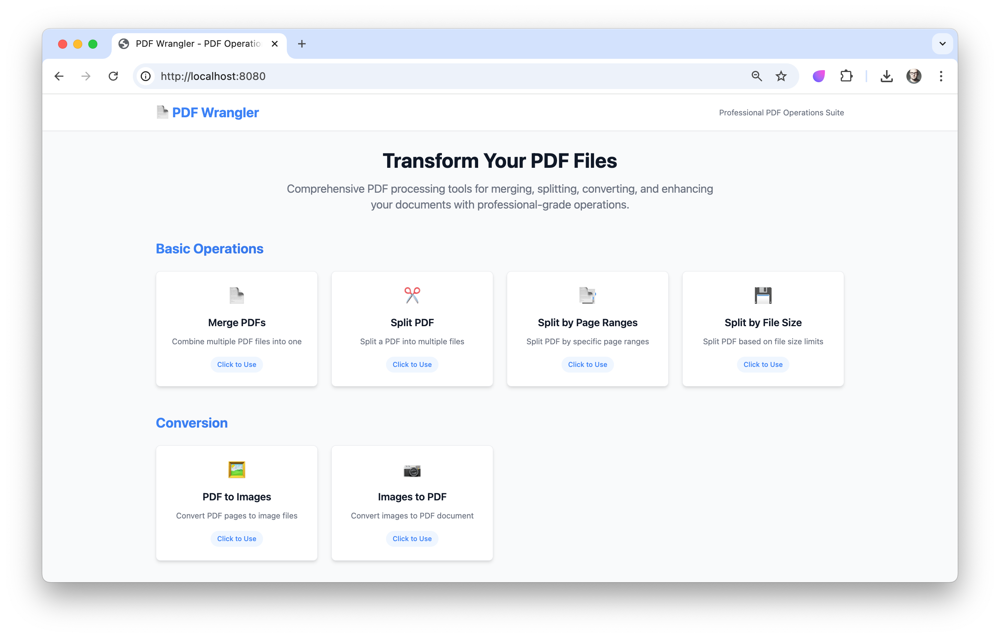
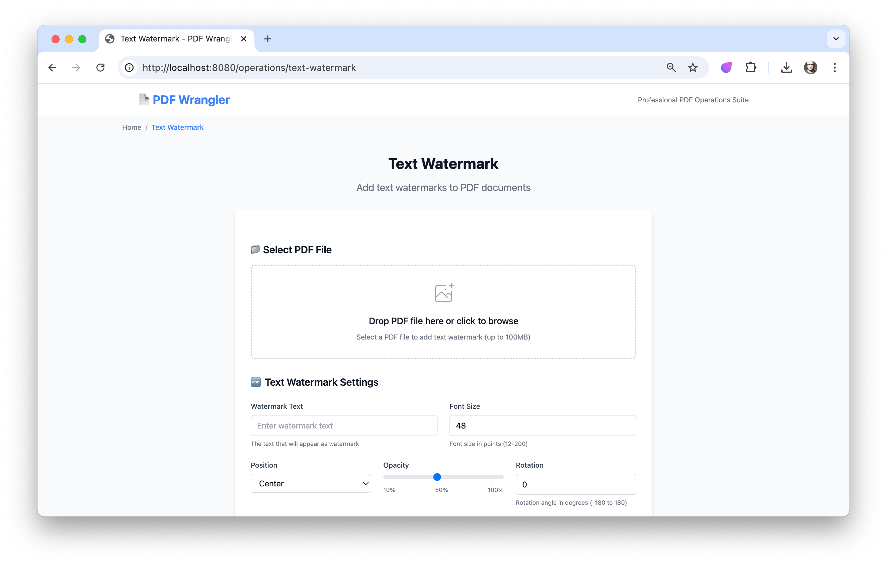

# PDF Wrangler

A Kotlin + Spring Boot application for advanced PDF processing with a simple Web UI and REST API. It supports merging, splitting, conversion (PDF ↔ images), watermarks (text/image), page operations (rotate, rearrange, scale, crop), visual enhancements (overlays, color manipulation, stamps), and batch workflows.

## Screenshots





## Key Features
- Merge multiple PDFs into one
- Split PDFs by simple mode, page ranges, or target size
- Convert PDF to images and images to PDF
- Apply text and image watermarks (positioning, opacity, rotation, repeat patterns)
- Page operations: rotate, rearrange, scale, crop, add page numbers, detect blank pages
- Visual enhancements: image overlays, stamps, color manipulation
- Batch operations for merge, split, conversion, and watermarking
- Web UI built with Thymeleaf for quick use and demos
- Structured logging, validation, and safeguards for file handling

## Architecture
- Language/Runtime: Kotlin, Java 21
- Frameworks: Spring Boot 3.5, Spring Web, Thymeleaf
- PDF Engine: Apache PDFBox 3.x and related tools
- Image IO: JAI ImageIO + TwelveMonkeys codecs (JPEG, TIFF, WebP, JP2)
- Office Conversion: JODConverter (LibreOffice integration)
- OCR: Tess4J (Tesseract)
- Database & Migration (optional): PostgreSQL + Flyway (schema under `src/main/resources/db/migration`)

Main entrypoint: `org.example.pdfwrangler.PdfWranglerApplication`.

Note: The application excludes DataSource and Hibernate JPA auto-configuration to allow running without a DB. If you want to use DB-backed features or Flyway migrations, configure a PostgreSQL datasource (see Configuration).

## Getting Started

### Prerequisites
- Java 21
- Internet access for Gradle to download dependencies
- (Optional) Docker & Docker Compose for running PostgreSQL
- (Optional) LibreOffice installed and accessible if using office conversions
- (Optional) Tesseract OCR installed for OCR-related features

### Build & Run
Using the Gradle Wrapper:

- Build:
  - macOS/Linux: `./gradlew build`
  - Windows: `gradlew.bat build`

- Run (dev):
  - macOS/Linux: `./gradlew bootRun`
  - Windows: `gradlew.bat bootRun`

- Run tests:
  - macOS/Linux: `./gradlew test`
  - Windows: `gradlew.bat test`

Web UI will be available at: `http://localhost:8080/`

### Docker Compose (PostgreSQL)
A minimal `compose.yaml` is provided to run PostgreSQL. Start it with:

```
docker compose up -d
```

Then configure the application to point to PostgreSQL (see Configuration). You can also adjust credentials in `compose.yaml` as needed.

## Web UI
- Open `http://localhost:8080/` for the dashboard
- Operation pages under `/operations/*` route to specific features and call corresponding API endpoints

Examples:
- Merge: `/operations/merge` → API `/api/pdf/merge`
- Split: `/operations/split` → API `/api/pdf/split`
- PDF → Image: `/operations/pdf-to-image` → API `/api/pdf-to-image/convert`
- Image → PDF: `/operations/image-to-pdf` → API `/api/conversion/images-to-pdf`
- Text Watermark: `/operations/text-watermark` → API `/api/watermark/text`
- Image Watermark: `/operations/image-watermark` → API `/api/watermark/image`

Additional pages include image overlay, stamps, color manipulation, rotate, rearrange, scale, crop, blank detection, and page numbers.

## REST API Overview
The controllers under `src/main/kotlin/org/example/pdfwrangler/controller` implement endpoints for the features above. Key controllers include:
- `MergePdfController` (merge PDFs)
- `SplitPdfController` (split operations)
- `PdfToImageController` and `ImageToPdfController` (conversions)
- `WatermarkController` (text/image watermarks)
- `PageOperationsController` (rotate, rearrange, scale, crop, page numbers, blank detection)
- `VisualEnhancementController` (image overlay, color manipulation, stamps)

For request/response schemas, see DTOs in `src/main/kotlin/org/example/pdfwrangler/dto` and browse controller annotations for exact endpoints and parameters.

## Configuration
Default configuration is in `src/main/resources/application.properties`:
- Multipart upload limits and temp directory
- Logging levels and structured logging
- Server timeouts
- Flyway migration settings
- Example PostgreSQL datasource (disabled at runtime unless you provide a DB and remove exclusions)

To enable PostgreSQL locally:
1. Start Postgres via Docker Compose.
2. Set environment variables or edit `application.properties` to point to your DB:
   - `SPRING_DATASOURCE_URL=jdbc:postgresql://localhost:5432/pdf_wrangler`
   - `SPRING_DATASOURCE_USERNAME=pdf_wrangler`
   - `SPRING_DATASOURCE_PASSWORD=pdf_wrangler_pass`
3. Remove the DataSource/Hibernate exclusions in `PdfWranglerApplication` if you want full Spring Data/JPA auto-config (optional and only if you add entities/repositories).

Temporary upload dir defaults to `${java.io.tmpdir}/pdf-wrangler-uploads`.

## Logging
Logs are written to `logs/pdf-wrangler.log` (see `application.properties`). Structured logging dependencies are included; you can configure JSON logging for production if desired.

## Testing
- Unit and integration tests use JUnit 5 and Testcontainers when needed (e.g., PostgreSQL).
- Run all tests: `./gradlew test`

## Development Notes
- Kotlin compiler is configured with `-Xjsr305=strict`.
- Flyway migrations are located in `src/main/resources/db/migration`.
- Static templates for the Web UI under `src/main/resources/templates`.

## Contributing
We manage implementation tasks in `docs/tasks.md` (151 tasks across phases). When contributing:
- Follow the phase-based sequence and task dependencies
- Reference task numbers in commit messages (e.g., `Task #23: Implement MergePdfController`)
- Mark completed tasks by changing `[ ]` to `[x]` in `docs/tasks.md`
- Keep code well-documented and add tests where applicable

To monitor progress:
```
grep -c "\[x\]" docs/tasks.md
# Percent complete (requires bc):
echo "scale=2; $(grep -c \"\[x\]\" docs/tasks.md) / 151 * 100" | bc
```

## Requirements and Specs
- High-level requirements: `docs/requirements.md`
- Detailed specifications: `docs/spec.md`
- Implementation plan: `docs/plan.md`

## License
This project currently has no explicit license file. If you plan to use or distribute this project, consider adding a LICENSE file (e.g., MIT, Apache 2.0).

## Acknowledgements
- Apache PDFBox
- TwelveMonkeys ImageIO
- JODConverter / LibreOffice
- Tess4J / Tesseract OCR
- Spring Boot & Thymeleaf
